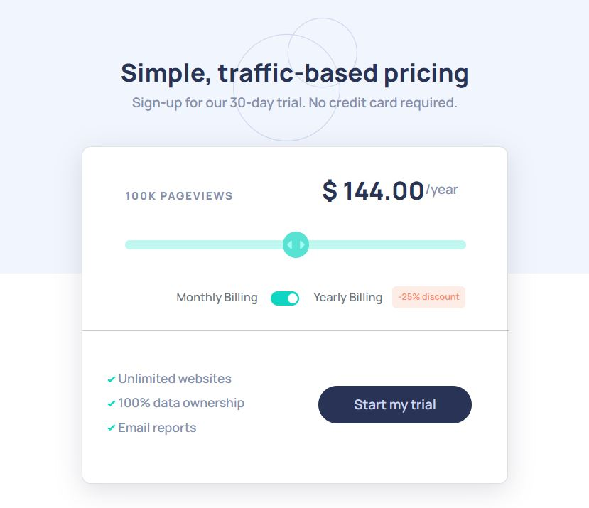

# Frontend Mentor - Interactive pricing component solution

This is a solution to the [Interactive pricing component challenge on Frontend Mentor](https://www.frontendmentor.io/challenges/interactive-pricing-component-t0m8PIyY8). Frontend Mentor challenges help you improve your coding skills by building realistic projects. 

## Table of contents

- [Overview](#overview)
  - [The challenge](#the-challenge)
  - [Screenshot](#screenshot)
  - [Links](#links)
- [My process](#my-process)
  - [Built with](#built-with)
  - [What I learned](#what-i-learned)
  - [Continued development](#continued-development)
  - [Useful resources](#useful-resources)
- [Author](#author)

**Note: Delete this note and update the table of contents based on what sections you keep.**

## Overview

### The challenge

Users should be able to:

- View the optimal layout for the app depending on their device's screen size
- See hover states for all interactive elements on the page
- Use the slider and toggle to see prices for different page view numbers

What types of challenges I confront and how was I able to solve them:

- Difficulty on creating slider range and toggle switch. I used Bootstrap 5 component and sources from w3school to create these two switches.
- Difficulty on connecting the two switches using Javascript. I wrote one callback function for the toggle switch and a function for the slider range and called the function after running the first callback function. 
- Implemented Bootstrap 5 for the card component for neater look. 

### Screenshot

The screenshot of my project. 

### Links

- [Solution URL] (https://github.com/LekhaKumar/Interactive-Pricing-Component-.git)
- [Live Site URL] (https://lekhakumar.github.io/Interactive-Pricing-Component-/)

## My process

### Built with

- Semantic HTML5 markup
- CSS custom properties
- Flexbox
- Bootstrap 5.0

### What I learned

Through this project, I learned on how to create an interactive pricing component by applying switches and sliders. Through this project, I can create a pricing component which can save space and avoid decluttering where the customer can check the prices by just slide the ranges. This project is a great milestone for me as I learned Javascript in more depth. 

### Continued development

This project is a great tool where the switches and slider ranges can be applied for other types of projects to increase the interactivity of the websites. 

### Useful resources

- Tips to create range slider: [How To Create Range Sliders from w3school](https://www.w3schools.com/howto/howto_js_rangeslider.asp)
- Bootstrap Library to create Toggle switch: [Checks and radios: Bootstrap v5.0](https://getbootstrap.com/docs/5.0/forms/checks-radios/#switches)

## Author

- Frontend Mentor - [@LekhaKumar](https://www.frontendmentor.io/profile/LekhaKumar)
- Twitter - [@Hamsalekha26](https://www.twitter.com/@Hamsalekha26)
- Linkedin - [Hamsalekha A Kumaresan](https://www.linkedin.com/in/hamsalekha-a-kumaresan-5b0676207/)

